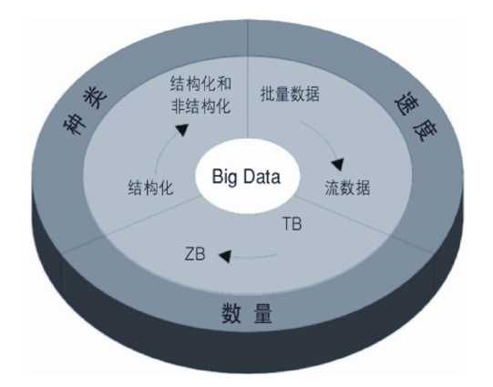
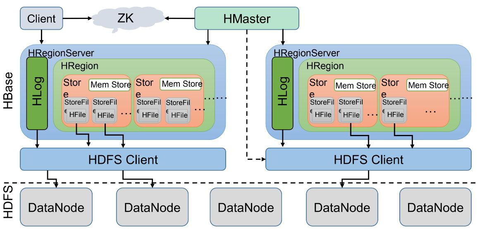
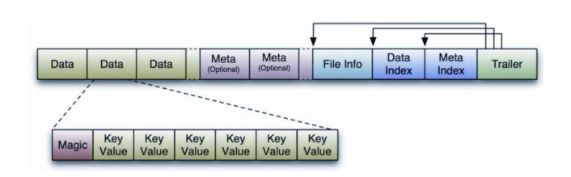
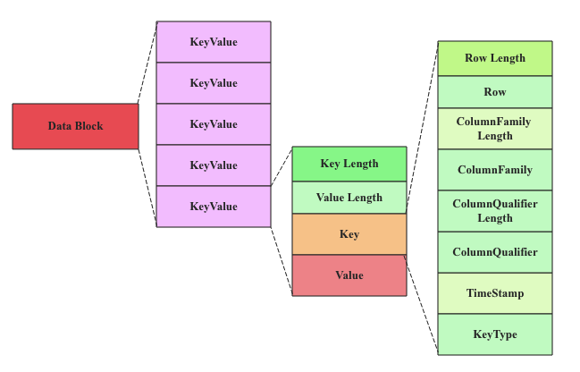
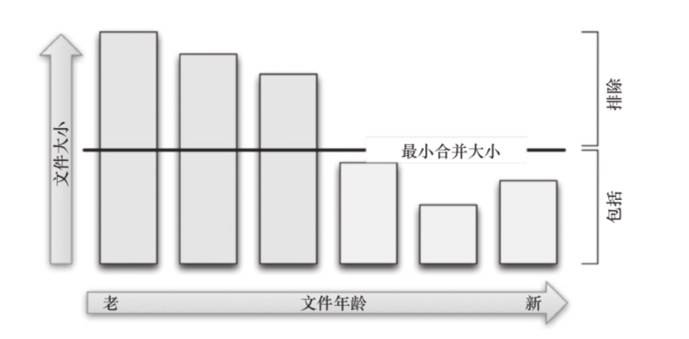

# HBase

## 什么是HBase ？
HBase是一个分布式的、面向列、非关系开源数据库，是Apache Hadoop项目的一部分，运行于HDFS文件系统之上。HBase是Google的[Bigtable论文](https://static.googleusercontent.com/media/research.google.com/en//archive/bigtable-osdi06.pdf)的开源实现，是一个高可靠、高性能、面向列、可伸缩的分布式存储系统，适合于大规模的非结构化数据存储。

## HBase有什么特点

**横向扩展性：** HBase 可以在成百上千台服务器上扩展，以存储和处理大规模数据集。它使用了 Hadoop 的分布式文件系统（HDFS）作为底层存储引擎，并通过水平分区和数据复制来实现高可用性和容错性。

**高性能：** HBase 提供了快速的读写访问，支持高并发和低延迟的数据访问。它通过将数据存储在内存中以及支持数据分区和索引来优化数据访问性能。

**面向列存储：** HBase 使用面向列的存储模式，这意味着它可以有效地处理稀疏数据和大量的列。这种存储模式使得 HBase 特别适合于分析型工作负载，如数据仓库、日志分析和实时分析。

+ 面向行和面向列数据库特征对比

| 维度             | 面向行数据库                 | 面向列数据库                |
|------------------|------------------------------|-----------------------------|
| 数据存储单位     | 行                           | 列族                          |
| 适用场景         | OLTP（事务处理）、关联查询  | OLAP（在线分析处理）、大规模数据存储和查询 |
| 读取性能         | 读取整个记录较快            | 读取特定列或列族较快          |
| 写入性能         | 单行写入较快                | 大规模写入较快               |
| 索引结构         | B-tree 或 B+tree             | LSM 树 或类似结构             |
| 查询灵活性       | 适用于复杂查询和事务         | 适用于聚合操作和宽表查询       |
| ACID 特性        | 具有较好的 ACID 特性         | 通常具有较弱的 ACID 特性       |
| 存储空间占用     | 相对较高                     | 相对较低                     |
| 数据压缩率       | 相对较低                     | 相对较高                     |
| 数据模型         | 关系型模型                   | 键值对模型（或称宽表模型）     |
 |  产品          | MySQL, PostgreSQL, Oracle Database, SQL Server, SQLite | Apache HBase, Apache Cassandra, Google Bigtable, ScyllaDB, Vertica |

**弹性模式：** HBase 提供了灵活的模式设计，允许在不停机的情况下动态地添加或删除列族，从而实现了数据模式的弹性和灵活性。

**支持大数据生态系统：** HBase 与 Apache Hadoop 生态系统紧密集成，可以与 Hadoop MapReduce、Apache Hive、Apache Spark 等其他大数据处理框架无缝地集成，从而实现对大规模数据的分析、挖掘和处理。

## HBase的应用场景有哪些？

1. **大规模数据随机实时读/写**：如果您需要存储和处理海量数据，并且需要快速地进行实时查询和检索，那么 HBase 是一个很好的选择。由于它采用了分布式存储和面向列的存储模式，可以实现高性能的随机读取和写入，从而支持实时数据查询和分析。

2. **高并发的数据访问**：HBase 提供了高并发的读写访问能力，可以同时处理大量的读写请求。因此，如果您的应用场景需要支持高并发的数据访问，例如社交网络应用、实时日志分析等，那么 HBase 是一个不错的选择。

3. **需要水平扩展的应用场景**：HBase 可以在成百上千台服务器上进行水平扩展，可以处理PB级别的数据量。因此，如果您的应用场景需要处理大规模数据，并且需要随着数据量的增长而进行水平扩展，那么 HBase 是一个合适的存储解决方案。

4. **实时数据处理和分析**：HBase 可以与实时数据处理框架（例如 Apache Storm、Apache Flink）结合使用，用于存储实时生成的数据，并且支持快速的数据查询和分析。因此，如果您的应用场景需要进行实时数据处理和分析，那么 HBase 是一个合适的选择。

## HBase的架构是怎样的

### HBase 的架构主要由以下几个组件组成：

1. **客户端：** 客户端是 HBase 的用户接口，用于与 HBase 集群进行交互。客户端可以通过 HBase 的 Java API 或 Thrift、REST 等接口来访问 HBase 集群，进行数据的读写操作。
2. **ZooKeeper：** ZooKeeper 是 HBase 的协调服务，用于协调 HBase 集群的状态和元数据信息。HBase 使用 ZooKeeper 来进行主节点的选举、RegionServer 的注册和状态监控等操作。
3. **HMaster：** HMaster 是 HBase 的主节点，负责管理 HBase 集群的元数据信息，包括表的创建、删除、分割、合并等操作。HMaster 还负责监控 RegionServer 的状态，并负责 RegionServer 的负载均衡和故障转移。
4. **RegionServer：** RegionServer 是 HBase 的工作节点，负责存储和处理数据。每个 RegionServer 可以管理多个 Region，每个 Region 对应一个 HBase 表的一个分区。RegionServer 负责处理客户端的读写请求，并负责数据的存储和检索。
5. **HLog：** HLog 是 HBase 的 Write-Ahead Log（WAL）文件，用于记录数据的变更操作。HLog 用于保证数据的一致性和持久性，以防止数据丢失。
6. **HRegion：** HRegion 是 HBase 的数据存储单元，对应一个 HBase 表的一个分区。每个 HRegion 包含多个 Store，每个 Store 对应一个列族。HRegion 负责存储和管理数据，并负责处理客户端的读写请求。
7. **Store：** Store 是 HBase 的数据存储单元，对应一个 HBase 表的一个列族。每个 Store 包含多个 StoreFile，每个 StoreFile 对应一个 HFile。Store 负责存储和管理数据，并负责处理客户端的读写请求。
8. **MemStore：** MemStore 是 HBase 的内存存储单元，用于缓存数据的变更操作。MemStore 用于缓存数据的变更操作，以提高数据的写入性能。当 MemStore 的数据量达到一定阈值时，会将数据刷写到磁盘上的 StoreFile 中。
9. **HFile：** HFile 是 HBase 的数据文件，用于存储数据。HFile 是基于 HDFS 的数据文件，用于存储 HBase 表的数据。HFile 采用了块压缩和块索引等技术，以提高数据的存储效率和读取性能。

10 **HDFS：** HDFS 是 HBase 的底层存储引擎，用于存储 HBase 表的数据。HBase 使用 HDFS 来存储 HFile 和 HLog 文件，以实现数据的持久化和高可靠性。
11. **DataNode：** DataNode 是 HDFS 的数据节点，用于存储 HBase 表的数据。HBase 使用 DataNode 来存储 HFile 和 HLog 文件，以实现数据的持久化和高可靠性。

## HBase应用开发经验总结

### RowKey设计

#### RowKey设计原则

**长度原则：** RowKey的长度尽量短，一般控制在10-100个字节之间，以便提高数据的存储效率和读取性能，实际存储结构如下图。除此之外尽可能定长,不要使用变长的自增数字,变长自增key，可能导致写倾斜在单机，出现写热点问题。 

**唯一原则：**

 必须在设计上保证RowKey的唯一性。由于在HBase中数据存储是Key-Value形式，若向HBase中同一张表插入相同RowKey的数据，在存储单个版本数据情况下，则原先存在的数据会被新的数据覆盖，多版本存储情况下，新的数据会被追加到原先的数据后面。

**排序原则：**

 HBase的RowKey是按照ASCII有序排序的，即按字典序排序，也就是字符大ASCII码的值的大小，所以值比较小的RowKey会排在前面,RowKey短的也会排在前面,因此我们在设计RowKey的时候要充分利用这点，将经常需要一起查询的数据放在一起，这样可以提高查询效率。

**散列原则：**

设计的RowKey应均匀的分布在各个HBase节点上,因为按字典序及表的分区来决定数据存储在哪个RegionServer上，如果RowKey的设计不合理，可能会导致数据倾斜，即数据集中在某个RegionServer上，如果前缀相同的RowKey过多，会导致数据倾斜，影响HBase的性能。

#### RowKey 热点问题

1. **顺序递增的RowKey**：
 - 当RowKey是顺序递增的时候，例如时间戳作为RowKey的一部分，如果写入速率过高，那么所有的写操作都会集中在最后的Region中，导致该Region成为热点写。同时，如果读取操作也集中在最新的数据上，那么这些读操作也会集中在同一个Region，导致热点读。

2. **随机分布的RowKey**：
 - 当RowKey的分布不均匀，例如采用随机生成的UUID作为RowKey，有些Region可能会负责大量的数据，而其他Region可能几乎没有数据。这样的话，负责大量数据的Region容易成为热点写，同时也可能成为热点读，因为访问这些数据的请求集中在一个Region上。

3. **某些特定的业务场景**：
 - 某些特定的业务场景可能会导致热点读和热点写，例如流行度较高的用户或热门的数据。如果大量的读写操作集中在某些特定的RowKey上，那么就会导致相关Region成为热点。

4. **批量写入或读取**：
 - 如果应用程序进行大量的批量写入或读取操作，并且这些操作都集中在一小部分RowKey上，那么就可能导致热点写或热点读。这种情况下，一些Region会承担大量的负载，而其他Region可能闲置。

#### RowKey常见设计优化方法

**Reversing逆序：**

  如果经初步设计出的RowKey在数据分布上不均匀，但RowKey尾部的数据却呈现出了良好的随机性，此时，可以考虑将RowKey的信息翻转，或者直接将尾部的bytes提前到RowKey的开头。 Reversing可以有效的使RowKey随机分布，但是牺牲了RowKey的有序性。将rowKey的部分逆序，可以有效的减少热点问题，但是牺牲了rowKey的有序性。

+ 缺点：利于Get操作，但不利于Scan操作，因为数据在原RowKey上的自然顺序已经被打乱。

**SaltingSalting（加盐):**

   在原RowKey的前面添加固定长度的随机数，也就是给RowKey分配一个随机前缀使它和之间的RowKey的开头不同,随机数能保障数据在所有Regions间的负载均衡。

+ 缺点：因为添加的是随机数，基于原RowKey查询时无法知道随机数是什么，那样在查询的时候就需要去各个可能的Regions中查找，Salting对于读取是利空的。并且加盐这种方式增加了读写时的吞吐量。

**Hashing:**
    基于RowKey的完整或部分数据进行Hash，而后将Hashing后的值完整替换或部分替换原RowKey的前缀部分。这里说的 hash 包含 MD5、sha1、sha256 或 sha512 等算法。
+ 缺点：与 Reversing 类似，Hashing 也不利于 Scan，因为打乱了原RowKey的自然顺序。

**Combining:**
    将多个字段组合成一个RowKey，这样可以保证RowKey的唯一性，同时也可以保证RowKey的有序性。例如，可以将时间戳和设备ID组合成一个RowKey，这样可以保证同一设备的数据存储在一起，同时也可以保证数据按时间顺序存储。

### 表结构设计原则

1. **表设计：**
    + 表名设计：建议生产线创建表时不要单独使用表名，而应该使用命名空间加表名的形式。同一个业务的相关表放在同一个命名空间下，不同业务使用不同的命名空间。这样可以方便管理，也可以避免表名冲突及权限控制
    + 列族设计：单业务单表尽可能保持少的列族数量、因底层存储HFile文件数量与列族数量成正比，列族数量越多，每次读取多个列族内数据时，读取的HFile文件越多，直接影响性能。
    + 列设计：避免设计过多的列，尽量将相关的数据存储在同一列族下，以减少列的数量。
    + 表属性配置
      + MAX_FILESIZE: 表示HBase表中HFile文件的最大大小，默认为10G。如果HFile文件的大小超过了这个值，HBase会自动触发Split操作，将HFile文件切分成更小的文件。
      + MEMSTORE_FLUSHSIZE: 表示HBase表中MemStore的最大大小，默认为128M。当MemStore的大小超过这个值时，HBase会自动触发Flush操作，将MemStore中的数据刷写到HFile文件中。
      + DURABILITY: 表示HBase表中数据的持久化策略，默认为USE_DEFAULT。可以设置为SKIP_WAL，表示不将数据写入WAL文件，以提高写入性能。但是这样会降低数据的持久性和可靠性。
      + READONLY: 表示HBase表是否只读，默认为false。可以设置为true，表示HBase表只读，不允许写入操作。这样可以保护数据不被修改。

2. **列族设计**：
 - 列族名称设计：列族名称应具有可读性和描述性，除此之外，列族名称的长度应尽量短。
 - 合理划分列族，将具有相似访问模式的列放在同一个列族中，以提高读取效率，因同一个列族内的数据存储在同一块HFile上，实际生产中一搬不超过3个。
 - 避免设计过多的列族，以减少HBase中的列族数量，从而降低维护成本,及同一张表内列族越多，每次读取多个列族内数据时，读取的HFile文件越多，即直接影响性能。
 - 列族配置
   - VERSIONS: 用于控制列族中数据的版本数，默认为1，即只保留最新的版本。如果需要保留多个版本，可以设置VERSIONS的值为2或更多。
   - BLOCKCACHE: 用于控制列族中数据的缓存策略，默认为true，即开启缓存。如果数据的**访问模式是随机读取，可以关闭缓存以节省内存。**
   - BLOOMFILTER: 布隆过滤器类型，可选项为NONE、ROW和ROWCOL，默认为ROW。ROW模式表示仅仅根据rowkey就可以判断待查找数据是否存在于HFile中，而ROWCOL模式只对指定列的随机读有优化作用，如果用户只根据rowkey定位所有数据，而没有具体指定列查找，ROWCOL模式就不会有任何效果。通常建议选择ROW模式。
   - TTL (Time To Live) ：数据失效时间。TTL是HBase非常重要的一个特性，可以让数据自动过期失效，不需要用户手动删除。根据实际业务情况配置数据保留时间，以节省存储空间。
   - COMPRESSION: 数据压缩算法，可选项为NONE、GZ、LZO、SNAPPY、BZIP2，默认为NONE。最重要的作用是减少数据存储成本，理论上SNAPPY算法的压缩率可以达到5∶1甚至更高，但是根据测试数据不同，压缩率可能并没有达到理论值，另一方面，压缩/解压缩需要消耗大量计算资源，对系统CPU资源需求较高。
   - DATA_BLOCK_ENCODING：数据编码算法，可选项NONE、PREFIX、DIFF、FASTDIFF和PREFIX_TREE。和压缩一样，编码最直接、最重要的作用也是减少数据存储成本；编码/解码一般也需要大量计算，需要消耗大量CPU资源。
   - BLOCKSIZE ：文件块大小。Block是HBase系统文件层面写入、读取的最小粒度，默认块大小为64K。对于不同的业务数据，块大小的合理设置对读写性能有很大的影响。通常来说，如果业务请求以get请求为主，可以考虑将块设置较小；如果以scan请求为主，可以将块调大；默认的64K块大小是在scan和get之间取得的一个平衡。

4. **列设计**：
 - 避免设计过多的列，尽量将相关的数据存储在同一列族下，以减少列的数量。
 - 列的命名应具有可读性和描述性，便于理解和维护。

### 数据访问模式

HBase支持两种主要的数据访问模式：随机访问和扫描访问。这两种模式各有适用的场景，可以根据具体需求选择合适的访问模式。

#### 随机访问模式

随机访问模式是指根据行键（Row Key）直接访问特定行数据的模式。在随机访问模式下，用户可以通过指定行键直接获取或修改相应的数据，而不需要扫描整个表。随机访问模式适用于需要快速定位和获取特定行数据的场景，通常用于查询、更新或删除单个数据记录的操作。RowKey设计时就不用考虑数据的存储连续性问题。

##### 特点：
- 快速：通过行键直接获取数据，读取速度非常快。
- 精准：能够准确定位到特定行数据，适用于精确查找和操作。

#### 扫描访问模式

  - 扫描访问模式是指按照顺序或范围扫描表中的数据的模式。在扫描访问模式下，用户可以指定起始行键和结束行键，按照字典序顺序扫描表中的数据，或者指定特定的行范围进行扫描。扫描访问模式适用于需要按照顺序或范围获取大量数据的场景，通常用于数据分析、统计或批量处理等操作。
  - 扫描访问模式需特别注意是否存在最新数据高频读写问题，如果存在，在设计RowKey 可设计散列前缀+Long.MAX_VALUE-时间戳，这样可以保证最新数据分散在不同的Region中，且最新数据在最后，不会影响其他数据的读写。

##### 特点：
- 适用于大量数据：能够高效处理大量数据的扫描和处理。
- 顺序访问：按照字典序顺序或指定范围顺序扫描数据，适用于顺序处理或统计。

 根据业务场景选择合适的数据访问模式，可以提高数据访问效率和性能、比如读多写少的高频查询场景、还是读少写多的高频写入同步统计分析场景。，还是两者结合。

## 文件合并 

HBase 中的存储管理机制通过监控和控制存储文件的数量和大小，以及定期执行合并和切分操作，来保证数据的存储和管理的高效性和稳定性。即小文件过多时触发合并，合并为大文件,来减少碎片文件数量,当大文件过大时触发Region切分，主要目的是为了保持数据的负载均衡和系统的性能，防止单机负载过高，导致性能下降。

### 小合并 Minor Compactio

小合并主要目的是合并多个较小的HFile文件，以减少存储文件数量，减少磁盘占用，并提高读取性能。

+ 触发时机： 
   + 当HFile数量达到一定阈值时。
   + 当某个列族的HFile文件数量超过一定阈值时。
   + 定期触发，以维护存储文件的整洁性和性能。
+ 影响范围： 小合并只影响某个列族的HFile文件，不会影响其他列族的数据。

### 大合并  Major Compactio

一般情况下，Major Compaction持续时间会比较长，整个过程会消耗大量系统资源，对上层业务有比较大的影响。因此线上部分数据量较大的业务通常推荐关闭自动触发Major Compaction功能，改为在业务低峰期手动触发（或设置策略自动在低峰期触发）。
## HBase的Client 接口封装

https://github.com/devon-ye/org-middle-ware/tree/develop/mw-HBase